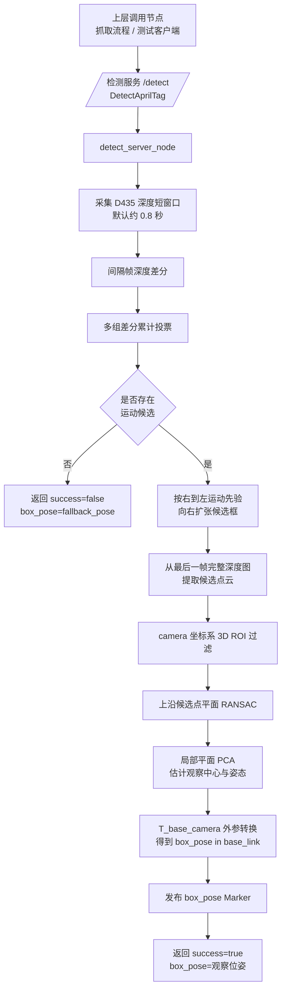

# 识别与定位流程说明

本文说明当前项目中的 D435 深度运动检测、box 当前观察定位和 ROS2 接口通信模式。

## 总体模式

- `detect_server_node` 是唯一检测服务节点。
- 上层仍通过 `/detect` 服务发起一次检测请求。
- 服务类型仍保持 `upper_limb_interface/srv/DetectAprilTag`，这是历史接口名，字段不变。
- 检测节点收到请求后，通过 RealSense 深度流采集约 0.8 秒短窗口。
- 检测节点不使用人工标记，不检测 tag，不做 tag 位姿融合。
- 成功时返回 box 在 `base_link` 下的当前观察位姿。
- 本阶段返回位姿只用于观察、显示、记录和提示，不代表可抓取位姿。

## 流程图



## 坐标变换

```text
T_base_box = T_base_camera * T_camera_box
```

`T_base_camera` 沿用原检测节点中的固定外参语义。机器人站位相对传送带的小幅变化不改变该外参。

## 接口通信

### Service

```text
/detect
upper_limb_interface/srv/DetectAprilTag
```

请求：

```text
bool capture_once
```

响应：

```text
bool success
string message
geometry_msgs/Pose box_pose
```

含义：

- `success=true`：`box_pose` 是深度方案估计出的当前观察位姿。
- `success=false`：`box_pose` 是 `fallback_pose`。
- `message`：包含检测状态、运动状态、几何状态、候选框和可见比例等调试信息。

### Topic

```text
box_pose
```

成功检测后发布 `visualization_msgs/msg/Marker`，默认 `frame_id=base_link`。

## 调试输出

每次服务请求会在 `debug_depth/` 保存调试图：

- `motion_*.png`：间隔帧差分投票后的运动掩膜。
- `depth_*.png`：最后一帧深度伪彩色图和扩张候选框。

## 关键边界

- 检测到箱体不等于可以抓取。
- 当前观察位姿不等于人工停止后的最终抓取位姿。
- 运动中输出的 `box_pose` 只能用于观察、显示、记录和提示。
- 深度 ROI、箱体尺寸和运动阈值需要根据现场实测调整。
