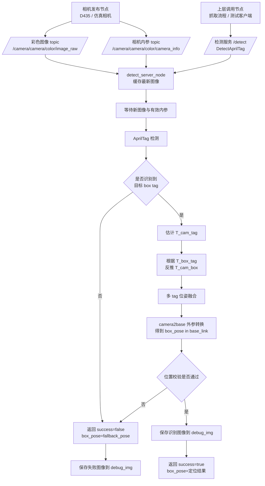

# 识别与定位流程说明

本文简要说明项目中 AprilTag 识别、box 定位和 ROS2 接口通信的整体模式。

## 总体模式

项目采用“相机发布节点”和“检测服务节点”分离的模式。

- 相机节点负责发布彩色图像和相机内参。
- `detect_server_node` 只订阅图像与内参，不负责启动相机。
- 上层节点通过 ROS2 service 请求一次检测结果。
- 检测节点收到请求后执行 AprilTag 识别、box 定位，并返回 `box_pose`。

## 流程图



## 识别与定位步骤

1. 相机节点持续发布彩色图像和相机内参。
2. `detect_server_node` 缓存最新图像和内参。
3. 上层节点调用 `DetectAprilTag` 服务。
4. 检测节点等待一帧新图像，使用 OpenCV 检测 AprilTag。
5. 只保留配置在 `box_tag_ids` 中的目标 tag。
6. 根据 tag 在 box 上的安装位置，将 `T_cam_tag` 换算为 `T_cam_box`。
7. 如果识别到多个目标 tag，则融合多个 box 位姿候选。
8. 使用内部 `camera2base` 外参转换到 `base_link` 坐标系。
9. 成功时返回定位结果；失败时返回 `fallback_pose`。

核心变换关系：

```text
T_cam_tag = T_cam_box * T_box_tag
T_cam_box = T_cam_tag * inverse(T_box_tag)
T_base_box = T_base_camera * T_cam_box
```

## 接口通信

### Topic 输入

检测节点订阅：

```text
/camera/camera/color/image_raw 
/camera/camera/color/camera_info 
```

图像 topic 只用于缓存最新帧；真正的识别计算由 service 请求触发。

### Service 接口

服务类型：

```text
/detect
upper_limb_interface/srv/DetectAprilTag
```

请求：

```text
bool capture_once
```

响应：

```text
bool success
string message
geometry_msgs/Pose box_pose
```

含义：

- `success=true`：`box_pose` 是识别出的 box 位姿。
- `success=false`：`box_pose` 是 `fallback_pose` 指定的失败位姿。
- `message`：说明本次识别结果或失败原因。


## 图像保存

每次服务请求完成识别流程后，检测节点会保存本次图像到 `debug_img`。

- 成功图像包含 tag 边框、tag ID、坐标轴、匹配到的 box tag ID 和 box 平移结果。
- 失败图像包含当前失败原因。
- 文件名带时间戳，不会覆盖历史图片。

## 关键边界

- 检测节点不启动相机，只消费 ROS topic。
- 当前坐标转换使用源码中的 `camera2base` 外参矩阵，不在服务回调中查 TF。
- 上层逻辑应优先根据 `success` 判断定位是否有效。
- tag 尺寸、tag 安装位姿、相机内参和 `camera2base` 必须一致，否则定位会偏移。
